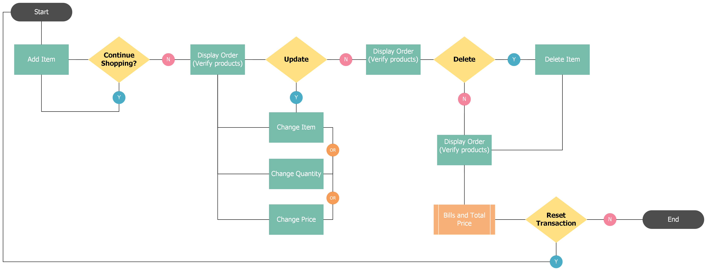
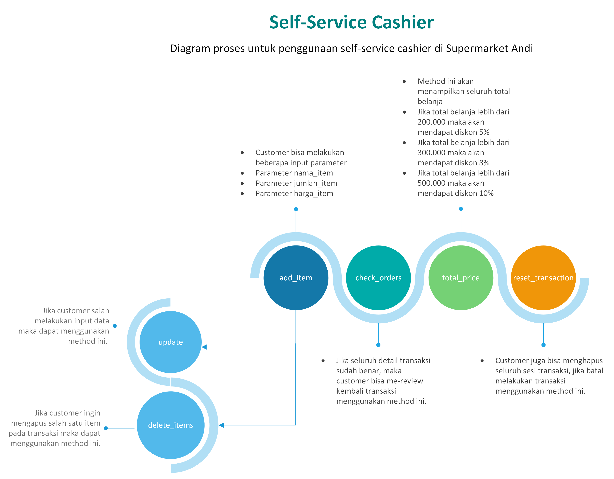

# *Python Project: Self-Service Cashier*

## Latar Belakang Problem

Andi adalah seorang pemilik supermarket besar di salah satu kota di Indonesia. Andi memiliki rencana untuk melakukan ekspansi bisnis, yaitu: Andi akan membuat sistem kasir yang self-service di supermarket miliknya. Sehingga customer bisa langsung memasukan item yang dibeli, jumlah yang dibeli dan fitur lain. Sehingga customer yang tidak berada di kota tersebut bisa membeli barang dari supermarket tersebut.

## *Tools*
### Bahasa Pemograman:
- Python

### *Libraries*:
- Pandas
- NumPy
- pytz
- datetime
- tabulate

<br/>

## *Requirements / Objectives*
### Tujuan Pembelajaran:
- Membuat *Self-Service Cashier* menggunakan Python
- Menggunakan OOP dalam pembuatan program Python
- Mengaplikasikan *Data Structure, Branching, try, and error* pembuatan program Python
- Membuat dokumentasi *docstring* pembuatan program Python
- Mengaplikasikan PEP8 dalam penulisan *clean code* pada program Python

<br/>

### Tujuan Program:
- Membuat objek dari `class Transaction()`
- Menambahkan *method* `add_item()` yang berisi parameter `nama_item`, `jumlah_item`, dan `harga_per_item` ke dalam *Self-Service Cashier*
- Menambahkan *method* `update_item_name()`, `update_item_qty()`, dan `update_item_price()`. Mengubah berdasarkan parameter `nama_item` untuk mengubah nilai tiap-tiap item, jumlah, dan harga ke dalam *Self-Service Cashier*. 
- Menambahkan *method* `delete_item()`ke dalam *Self-Service Cashier* untuk menghapus satu item berdasarkan parameter `nama_item`
- Menambahkan *method* `reset_transaction()` ke dalam *Self-Service Cashier* untuk menghapus semua transaksi
- Menambahkan *method* `check_order()` ke dalam *Self-Service Cashier* untuk melihat seluruh detail transaksi
- Menambahkan *method* `total_price()` ke dalam *Self-Service Cashier* untuk mengetahui total pembayaran, dengan beberapa ketentuan:
    - Jika total belanja di atas Rp.200.000 maka akan mendapatkan diskon 5%
    - Jika total belanja di atas Rp.300.000 maka akan mendapatkan diskon 8%
    - Jika total belanja di atas Rp.500.000 maka akan mendapatkan diskon 10%

<br/>

## *Flowchart*



Fig. 1 Merupakan flowchart atau alur program *self-service cashier*.

<br/>

### Proses Diagram



Secara singkat proses seorang *customer* dalam melakukan pembelanjaan pertama kali adalah dengan memasukan barang ke dalam list belanja dengan menggunakan *method* `add_item` dengan *input* parameter `nama_item`, `jumlah_item` dan `harga_item`. Selanjutnya untuk mengecek apakah pesanannya sudah sesuai *customer* dapat melihat seluruh daftar belanja dengan menggunakan *method* `check_orders`. Jika *customer* salah memasukan salah satu dari parameter tersebut maka *customer* dapat merubah nilainya dengan menggunakan *method* `update` dengan *input* parameter `nama_item` dan `parameter` apa yang ingin dirubah. Apabila *customer* ingin membatalkan salah satu transaksi maka dapat menggunakan *method* `delete_item`. Jika semua detail transaksi sudah sesuai maka *customer* dapat mengetahui total belanja menggunakan *method* `total_price`. Setelah total belanja sudah keluar *customer* dapat menghapus seluruh sesi transaksi dengan menggunakan *method* `reset_transaction` atau bisa langsung melakukan pembayaran.

<br/>

### Pseudocode
- *attribute class* berisi dataframe kosong

- *attribute* mengenai toko atau transaksi
    ```python
    def ___init___:
        nama toko
        alamat
        nomor telepon
        tanggal
        waktu
        timestamp
    ```

- add_item menambahkan item, jumlah dan harga ke dalam sesi transaksi
    ```python
    def add_item(nama_item, jumlah_item, harga_item):
        cek tipe data parameter
        masukan parameter ke dalam attribute class
    ```

- update_item_name merubah nama item jika terjadi kesalahan input
    ```python
    def update_item_name(nama_item, update_nama_item):
        cek tipe data parameter
        cek nama item dalam attribute class
        merubah nama item dalam attribute class
    ```

- update_item_qty merubah jumlah item berdasarkan nama item jika terjadi kesalahan input
    ```python
    def update_item_qty(nama_item, update_jumlah_item):
        cek tipe data parameter
        cek nama item di dalam attribute class
        merubah jumlah item berdasarkan nama item
    ```

- update_item_price merubah harga item berdasarkan nama item jika terjadi kesalahan input
    ```python
    def update_item_qty(nama_item, update_harga_item):
        cek tipe data parameter
        cek nama item di dalam attribute class
        merubah harga item berdasarkan nama item
    ```

- delete_item menghapus satu baris berdasarkan nama_item dalam transaksi 
    ```python
    def delete_item(nama_item):
        cek tipe data parameter
        cek nama item di dalam attribute class
        menghapus jumlah dan harga berdasarkan nama item
    ```

- reset_transaction menghapus semua sesi transaksi
    ```python
    def reset_transaction():
        menampilkan pesan item sudah di reset
        menampilakn tabel kosong
    ```

- check_order menampilkan semua detail transaksi dalam bentuk tabel
    ```python
    def check_order():
        membuat dataframe baru dengan cara copy attribute class
        manambahkan kolom total harga untuk tiap item
        membuat dan menampilkan tabel
    ```

- total_price menampilkan total belanja dari sesi transaksi dengan ketentuan diskon
    ```python
    def total_transaction():
        membuat dataframe baru dengan cara copy attribute class
        manambahkan kolom total harga untuk tiap item
        menjumlahkan kolom total harga
        if total belanja < 200000:
            harga normal
        if total belanja < 30000:
            diskon 5 persen
        if total belanja < 500000:
            diskon 8 persen
        if total belanja > 500000:
            diskon 10 persen
    ```

<br/>

## *Function / Attribute*

*Script* `main.py` berfungsi untuk memanggil *module* `cashier.py` yang di dalamnya terdapat beberapa *function/method*, yaitu:
1. `add_item` yang berfungsi untuk memasukan item ke dalam *list* belanja;
2. `update_item_name` yang berfungsi untuk merubah `nama_item` di dalam *list* belanja;
3. `update_item_qty` yang berfungsi untuk merubah `jumlah_item` di dalam *list* belanja;
4. `update_item_price` yang berfungsi untuk merubah `harga_item` di dalam *list* belanja;
5. `delete_item` yang berfungsi untuk menghapus satu item di dalam *list* belanja;
6. `check_orders` yang berfungsi untuk menampilkan seluruh item di dalam *list* belanja;
7. `total_price` yang berfungsi untuk menampilkan harga yang harus dibayar berdasarkan seluruh item di dalam *list* belanja;
8. `reset_transaction` yang berfungsi untuk menghapus seluruh item dari sesi transaksi.

### Class Atribute

```python
    empty_dict = {
        "Item": [], 
        "JumlahBarang": [], 
        "Harga": []}
    data = pd.DataFrame(empty_dict)
```
Pada *class attribute* berisikan dataframe kosong untuk menampung semua data transaksi

### *Attribute*

```python
def __init__(self):
        self.nama_toko = "Supermarket Andi"
        self.alamat = "Kota Besar"
        self.no_telepon = "08098888"
        # Initiate current time
        now = datetime.datetime.now()
        # Create date, timezone jakarta
        self.date = (
            pytz.timezone("Asia/Jakarta").localize(now).strftime("%Y-%m-%d")
        )
        # Create time, timezone jakarta
        self.created_at = (
            pytz.timezone("Asia/Jakarta").localize(now).strftime("%H:%M:%S")
        )
        # Created timestamp
        self.timestamp = now.timestamp()
```
*Attribute* ini berisi berbagai informasi toko dan transaksi, seperti: Nama Toko, Alamat, Nomor Telepon, Tanggal Transaksi, Waktu Transaksi, dan *Timestamp*. Pada proses ini menggunakan *library* `datetime` untuk mengakses fungsi `datetime` dan *library* `pytz` untuk mengakses fungsi `timezone` dengan menggunakan `timezone` Jakarta.

### *Method*
- **`add_item()`**

    ```python
    def add_item(
        self, nama_item: str, jumlah_item: int, harga_item: float or int
    ):
        """Fungsi untuk menambahkan nama_item, jumlah_item, harga_item
            ke dalam attribute class data

        Args:
            nama_item (str): nama item
            jumlah_item (int): jumlah item
            harga_item (float or int): harga per item

        Raises:
            TypeError:
                Jika parameter nama_item bukan string
            TypeError:
                Jika parameter jumlah_item bukan integer
            TypeError:
                Jika parameter harga_item bukan float atau integer
        """

        # Check type of data parameter nama_item
        if type(nama_item) != str:
            raise TypeError(
                "Parameter 'nama_item' harus memiliki tipe data 'str'"
            )
        # Check type of data parameter jumlah_item
        elif type(jumlah_item) != int:
            raise TypeError(
                "Parameter 'jumlah_item' harus memiliki tipe data 'int'"
            )
        # Check type of data parameter harga_item
        elif type(harga_item) != float and type(harga_item) != int:
            raise TypeError(
                "Parameter 'harga_item' memiliki tipe data 'float' atau 'int'"
            )
        else:
            # Assign parameter into attribute class data
            self.data.loc[len(self.data)] = [
                nama_item,
                jumlah_item,
                harga_item,
            ]
            print("Item yang Anda masukan:")
            print(f"Nama Item     : {nama_item}")
            print(f"Jumlah Barang : {jumlah_item}")
            print(f"Harga per-Item: Rp. {harga_item}")
    ```

    Pada *method* `add_item` ini memerlukan *input* parameter `nama_item` yang bertipe data `str`, `jumlah_item` yang bertipe data `int` dan `harga_item` yang bertipe data `float` atau `int`. Jika tipe data pada *input* parameter tidak sesuai maka akan me-`raise` `TypeError`. Jika sudah sesuai maka akan langsung ke proses memasukan *input* parameter tersebut ke dalam `DataFrame` di dalam *attribute class*. Selain memasukan ke dalam `DataFrame` *method* ini pun akan mengeluarkan pesan item apa saja yang sudah di-*input*, jika terjadi salah *input* maka dapat di-*update*.

<br/>

- **`update_item_name()`**
    ```python
    def update_item_name(self, nama_item: str, update_nama_item: str):
        """Fungsi untuk mengupdate nama_item jika nama_item terdapat
            dalam attribute class data

        Args:
            nama_item (str): nama item lama
            update_nama_item (str): nama item baru

        Raises:
            ValueError:
                Jika nama_item tidak terdapat dalam attribute class data
            TypeError:
                Jika parameter nama_item bukan string
            TypeError:
                Jika parameter update_nama_item bukan string
        """
        # Create list of all item in attribute class data
        list_nama_item = self.data["Item"].tolist()
        try:
            # Check parameter nama_item in list_nama_item
            if nama_item not in list_nama_item:
                raise ValueError
            else:
                # Check type of data parameter nama_item
                if type(nama_item) != str:
                    raise TypeError(
                        "Parameter 'nama_item' harus memiliki tipe data 'str'"
                    )
                # Check type of data parameter update_nama_item
                elif type(update_nama_item) != str:
                    raise TypeError(
                        "Parameter 'update_nama_item' memiliki tipe data 'str'"
                    )
                else:
                    # Filter by name_item
                    # assign update_nama_item in attribute class data
                    self.data.loc[
                        self.data.Item == nama_item, "Item"
                    ] = update_nama_item
                    print(
                        f"Anda merubah {nama_item} menjadi {update_nama_item}"
                    )

        except ValueError:
            print(f"Item {nama_item} tidak ditemukan dalam sesi transaksi ini")
    ```

    Pada *method* `update_item_name` ini memerlukan *input* parameter `nama_item` yang bertipe data `str` dan `update_nama_item` yang bertipe data `str`. Jika tipe data pada *input* parameter tidak sesuai maka akan me-`raise` `TypeError`. Jika sudah sesuai maka akan membuat `list ` yang berisikan kolom nama item dalam `DataFrame`, `list` tersebut berfungsi untuk memastikan apakah parameter `nama_item` terdapat di dalam `DataFrame` atau tidak. 

    <br/>

    Jika `nama_item` tidak terdapat dalam `DataFrame` maka akan me-`raise` `ValueError`. Jika tipe data sudah sesuai dan parameter sudah berada di dalam `DataFrame` maka langsung mencari `index` dari parameter `nama_item` di dalam  kolom `Item` pada `DataFrame` kemudian langsung mengubah `nama_item` menjadi `update_nama_item`. Selain merubah `nama_item` di dalam `DataFrame` *method* ini pun akan mengeluarkan pesan `nama_item` dirubah menjadi `update_nama_item`.

<br/>

- **`update_qty_item()`**

    ```python
    def update_item_qty(self, nama_item: str, update_jml_item: int):
        """Fungsi untuk mengupdate jumlah_item dalam jika nama_item
            terdapat dalam attribute class data

        Args:
            nama_item (str):
                    nama item sebagai keys untuk mengupdate jumlah_item
            update_jml_item (int):
                    value jumlah_item baru yang akan di update

        Raises:
            ValueError:
                Jika nama_item tidak terdapat dalam attribute class data
            TypeError:
                Jika parameter nama_item bukan string
            TypeError:
                Jika parameter update_jml_item bukan integer
        """

        # Create list of all item in attribute class data
        list_nama_item = self.data["Item"].tolist()
        try:
            # Check parameter nama_item in list_nama_item
            if nama_item not in list_nama_item:
                raise ValueError
            else:
                # Check type of data parameter nama_item
                if type(nama_item) != str:
                    raise TypeError(
                        "Parameter 'nama_item' harus memiliki tipe data 'str'"
                    )
                # Check type of data parameter update_jml_item
                elif type(update_jml_item) != int:
                    raise TypeError(
                        "Parameter 'update_jml_item' memiliki tipe data 'int'"
                    )
                else:
                    # Filter by nama_item
                    # assign update_jml_item in attribute class data
                    self.data.loc[
                        self.data.Item == nama_item, "JumlahBarang"
                    ] = update_jml_item
                    print(
                        f"Anda merubah Jumlah {nama_item} menjadi {update_jml_item}"
                    )

        except ValueError:
            print(f"Item {nama_item} tidak ditemukan dalam sesi transaksi ini")
    ```

    Pada *method* `update_item_qty` ini memerlukan *input* parameter `nama_item` yang bertipe data `str` dan `update_jml_item` yang bertipe data `int`. Jika tipe data pada *input* parameter tidak sesuai maka akan me-`raise` `TypeError`. Jika sudah sesuai maka akan membuat `list ` yang berisikan kolom nama item dalam `DataFrame`, `list` tersebut berfungsi untuk memastikan apakah parameter `nama_item` terdapat di dalam `DataFrame` atau tidak. 

    <br/>

    Jika `nama_item` tidak terdapat dalam `DataFrame` maka akan me-`raise` `ValueError`. Jika tipe data sudah sesuai dan parameter sudah berada di dalam `DataFrame` maka langsung mencari `index` dari parameter `nama_item` di dalam  kolom `JumlahBarang` pada `DataFrame` kemudian langsung mengubah `jumlah_item` menjadi `update_jml_item`. Selain merubah `jumlah_item` di dalam `DataFrame` *method* ini pun akan mengeluarkan pesan jumlah `nama_item` dirubah menjadi `update_nama_item`.

<br/>

- **`update_item_price()`**
    ```python
    def update_item_price(self, nama_item: str, update_harga: float or int):
        """Fungsi untuk mengupdate harga dalam jika nama_item terdapat
            dalam attribute class data

        Args:
            nama_item (str): nama item sebagai keys untuk mengupdate harga
            update_harga (float / int): value harga baru yang akan di update

        Raises:
            ValueError:
                Jika nama_item tidak terdapat dalam attribute class data
            TypeError:
                Jika parameter nama_item bukan string
            TypeError:
                Jika parameter update_harga bukan integer atau float
        """
        # Create list of all item in attribute class data
        list_nama_item = self.data["Item"].tolist()
        try:
            # Check parameter nama_item in list_nama_item
            if nama_item not in list_nama_item:
                raise ValueError

            else:
                # Check type of data parameter nama_item
                if type(nama_item) != str:
                    raise TypeError(
                        "Parameter 'nama_item' harus memiliki tipe data 'str'"
                    )

                # Check type of data parameter update_harga
                elif type(update_harga) != float and type(update_harga) != int:
                    raise TypeError(
                        "Parameter 'update_harga' memiliki tipe data float/int"
                    )

                else:
                    # Filter by nama_item
                    # assign update_harga in attribute class data
                    self.data.loc[
                        self.data.Item == nama_item, "Harga"
                    ] = update_harga
                    print(
                        f"Anda merubah harga {nama_item} menjadi {update_harga}"
                    )

        except ValueError:
            print(f"Item {nama_item} tidak ditemukan dalam sesi transaksi ini")
    ```

    Pada *method* `update_item_price` ini memerlukan *input* parameter `nama_item` yang bertipe data `str` dan `update_harga` yang bertipe data `float` atau `int`. Jika tipe data pada *input* parameter tidak sesuai maka akan me-`raise` `TypeError`. Jika sudah sesuai maka akan membuat `list` yang berisikan kolom nama item dalam `DataFrame`, `list` tersebut berfungsi untuk memastikan apakah parameter `nama_item` terdapat di dalam `DataFrame` atau tidak. 

    <br/>

    Jika `nama_item` tidak terdapat dalam `DataFrame` maka akan me-`raise` `ValueError`. Jika tipe data sudah sesuai dan parameter sudah berada di dalam `DataFrame` maka langsung mencari `index` dari parameter `nama_item` di dalam  kolom `Harga` pada `DataFrame` kemudian langsung mengubah `harga_item` menjadi `update_harga`. Selain merubah `harga_item` di dalam `DataFrame` *method* ini pun akan mengeluarkan pesan harga `nama_item` dirubah menjadi `update_harga`.

    <br/>

- **`delete_item()`**
    ```python
    def delete_item(self, nama_item: str):
        """Fungsi untuk menghapus salah satu item yang terdapat dalam
            attribute class data

        Args:
            nama_item (str): nama_item yang ingin dihapus

        Raises:
            ValueError:
                Jika nama_item tidak terdapat dalam attribute class data
            TypeError:
                Jika parameter nama_item bukan string

        Returns:
           table : order tabel dengan attribute class data yang masih aktif
        """

        # Create list of all item in attribute class data
        list_nama_item = self.data["Item"].tolist()
        try:
            # Check parameter nama_item in list_nama_item
            if nama_item not in list_nama_item:
                raise ValueError

            else:
                # Check type of data parameter nama_item
                if type(nama_item) != str:
                    raise TypeError(
                        "Parameter 'nama_item' harus memiliki tipe data 'str'"
                    )
                else:
                    # Show deleted item
                    print(
                        f"Anda telah menghapus item {nama_item} dari transaksi"
                    )

                    # Filter and drop by nama_item
                    data = self.data.drop(
                        self.data.index[self.data.Item == nama_item],
                        inplace=True,
                    )

                    # Assign and show table
                    table = tabulate(data, headers="keys", tablefmt="psql")

                    return print(table)

        except ValueError:
            print(f"Item {nama_item} tidak ditemukan dalam sesi transaksi ini")
    ```

    Pada *method* `delete_item` ini memerlukan *input* parameter `nama_item` yang bertipe data `str`. Jika tipe data pada *input* parameter tidak sesuai maka akan me-`raise` `TypeError`. Jika sudah sesuai maka akan membuat `list` yang berisikan kolom nama item dalam `DataFrame`, `list` tersebut berfungsi untuk memastikan apakah parameter `nama_item` terdapat di dalam `DataFrame` atau tidak. 

    <br/>

    Jika `nama_item` tidak terdapat dalam `DataFrame` maka akan me-`raise` `ValueError`. Jika tipe data sudah sesuai dan parameter sudah berada di dalam `DataFrame` maka langsung mencari `index` dari parameter `nama_item` di dalam  kolom `Item` pada `DataFrame` dan akan menghapus `row` dari `nama_item` tersebut. Setelah menghapus `row` tersebut akan mengeluarkan pesan `nama` item telah dihapus dari *list* belanja. Selanjutnya akan menampilkan tebel dari *list* belanja yang tersisa.

    <br/>

- **`check_orders()`**
    ```python
    def check_order(self):
        """Fungsi untuk menghitung dan menampilkan total harga untuk tiap item

        Returns:
            table: Tabel order dengan total harga untuk tiap transaksinya
        """

        # Copy attribute class data
        output_data = self.data.copy()

        # Create new column
        output_data["TotalHarga"] = (
            output_data.JumlahBarang * output_data.Harga
        )
        # Create and show table
        table = tabulate(output_data, headers="keys", tablefmt="psql")

        return print(table)
    ```

    Pada *method* `check_orders` ini tidak memerlukan *input* parameter apa pun, sehingga yang pertama dilakukan adalah membuat *copy* dari `DataFrame` dalam *attribute class* untuk membuat `DataFrame` baru yang berisi kolom baru yang bernama `TotalHarga`. Kolom baru ini berisi mengenai total harga dari setiap item, dengan kata lain merupakan agregasi dari kolom `JumlahBarang` dan `Harga`. Setelah pembuatan kolom baru selesai maka fungsi ini akan me-*return* detail tabel transaksi yang menggunakan `library tabulate`.

    <br/>

- *`total_transaction()`*
    ```python
    def total_price(self):
        """Fungsi untuk menghitung total transaksi beserta diskonnya

        Returns:
            int : total transaksi
        """
        # Copy attribute class data
        output_data = self.data.copy()
        # Create new column
        output_data["TotalHarga"] = (
            output_data.JumlahBarang * output_data.Harga
        )
        # Assign variable total payment
        total = np.sum(output_data.TotalHarga)

        # If total payment les than 200.000 get normal price
        if total >= 0 and total <= 200_000:
            return print(f"Total Transaksi Anda adalah Rp.{int(total)}")

        # if total paymen more than 200.000 and less than 300.000
        # Get 5 percent discount
        elif total > 200_000 and total <= 300_000:
            total_belanja = total * 0.95
            return print(
                f"Total Transaksi Anda adalah Rp.{int(total_belanja)}"
            )

        # if total paymen more than 300.000 and less than 500.000
        # Get 8 percent discount
        elif total > 300_000 and total <= 500_000:
            total_belanja = total * 0.92
            return print(
                f"Total Transaksi Anda adalah Rp.{int(total_belanja)}"
            )

        # if total paymen more than 500.000, get 10 percent discount
        elif total > 500_000:
            total_belanja = total * 0.90
            return print(
                f"Total Transaksi Anda adalah Rp.{int(total_belanja)}"
            )

        else:
            return "Total Belanja Tidak Boleh Negatif"
    ```

     Pada *method* `total_price` ini tidak memerlukan *input* parameter apa pun, sehingga yang pertama dilakukan adalah membuat *copy* dari `DataFrame` dalam *attribute class* untuk membuat `DataFrame` baru yang berisi kolom baru yang bernama `TotalHarga`. Kolom baru ini berisi mengenai total harga dari setiap item, dengan kata lain merupakan agregasi dari kolom `JumlahBarang` dan `Harga`. Setelah pembuatan kolom baru selesai maka kolom `TotalHarga` akan diagregasi dengam `SUM` untuk mengetahui nilai total belanja.

     <br/>

     Pada *method* `total_price` ini memiliki beberapa ketentuan mengenai total belanja yang akan dibayarkan oleh *customer* melalui diskon. Harga diskon diterapkan dengan beberapa kriteria:
     1. Jika total belanjanya lebih dari Rp.200.000 maka akan mendapat potongan diskon sebesar 5 persen;
     2. Jika total belanjanya lebih dari Rp.300.000 maka akan mendapat potongan diskon sebesar 8 persen;
     3. Jika total belanjanya lebih dari Rp.500.000 maka akan mendapat potongan diskon sebesar 10 persen.

    <br/>

- *`reset_transaction()`*
    ```python
    def reset_transaction(self):
        """Fungsi untuk menghapus semua item dalam attribute class data

        Returns:
            table: order tabel kosong
        """

        # Show blank table
        print("Semua item berhasil di delete!")

        # Drop index in attribute class data
        self.data.drop(self.data.index, inplace=True)

        # Create  and show table
        table = tabulate(self.data, headers="keys", tablefmt="psql")

        return print(table)
    ```

    Pada *method* `reset_transaction` ini tidak memerlukan *input* parameter apa pun, sehingga yang pertama dilakukan adalah menghapus semua yang ada di dalam `DataFrame` dengan menggunakan `method` `drop()` dari `library pandas`. Selanjutnya akan menampilkan pesan "Semua item berhasil di delete!" yang selanjutnya akan me-`return` *blank table*.

<br/>

## *Test Case*

1. Test Case 1 - Customer ingin menambahkan dua item menggunakan method `add_item()`. Item yang ditambahkan sebagai berikut:
    - Nama Item: Ayam Goreng, Qty: 2, Harga: 20.000
    - Nama Item: Pasta Gigi, Qty: 3, Harga: 15.000
<br/><br/>


    ```python
    user = Transaction()
    # Test Case 1
    # Add Item 1
    print("Test Case 1")
    print("-----------")
    user.add_item("Ayam Goreng", 2, 20_000)
    print("\n")
    # Add Item 2
    user.add_item("Pasta Gigi", 3, 15_000)
    print("\n")
    print("Order Table :")
    user.check_order()
    user.total_price()
    ```
    Output :

    

2. Test Case 2 - Ternyata Customer salah membeli salah satu item dari belnjaan yang sudah ditambahkan, maka Customer menggunakan method `delete_item()` untuk menghapus item. Item yang ingin dihapus adalah **Pasta Gigi**


    ```python
    # Test Case 2
    # Delete pasta gigi from order table
    print("\n")
    print("Test Case 2")
    print("-----------")
    user.delete_item("Pasta Gigi")
    print("Order Table :")
    user.check_order()
    user.total_price()
    ```

    Output :

    

3. Test Case 3 - Ternyata Customer salah memasukkan item yang ingin dibelanjakan! Daripada menghapus satu-satu, maka Customer cukup menggunakan method `reset_transaction()` untuk menghapus semua item yang sudah ditambahkan.
<br/>

    ```python
    # Test Case 3
    # Reset all transaction
    print("\n")
    print("Test Case 3")
    print("-----------")
    user.reset_transaction()
    ```

    Output :

    

4. Test Case 4 - Setelah Customer selesai berbelanja, akan menghitung total belanja yang harus dibayarkan menggunakan *method* `total_price()`. Sebelum mengeluarkan output total belanja akan menampilkan item-item yang dibeli.
<br/>

    ```python
    print("\n")
    print("Test Case 4")
    print("-----------")
    # Add Item 1
    user.add_item("Ayam Goreng", 2, 20_000)
    print("\n")
    # Add Item 2
    user.add_item("Pasta Gigi", 3, 15_000)
    print("\n")
    # Add Item 3
    user.add_item("Mainan Mobil", 1, 200_000)
    print("\n")
    # Add Item 4
    user.add_item("Mie Instan", 5, 3_000)
    print("\n")
    print("Order Table :")
    user.check_order()
    user.total_price()
    ```

    Output :

    

5. Test Case 5 - Ternyata Customer salah memasukan beberapa item, jumlah dan harga. Maka Custumer akan mengubahnya menggunakan *method* `update_item_name()`, `update_item_qty()`, dan `update_item_price()`
<br/>

    ```python
    # Test Case 5
    # Update Item, JumlahBarang, dan Harga
    print("\n")
    print("Test Case 5")
    print("-----------")
    print("Order Table Before:")
    user.check_order()
    user.total_price()
    print("\n")
    # Update Item pasta gigi
    user.update_item_name("Pasta Gigi", "Sabun Mandi")
    # Update JumlahBarang ayam goreng
    user.update_item_qty("Ayam Goreng", 3)
    # Update Harga mie instan
    user.update_item_price("Mie Instan", 3_500)
    print("\n")
    print("Order Table After:")
    user.check_order()
    user.total_price()
    ```

    Output :

    

<br/>

## *Conclusion*

Secara umum program *self-service cashier* ini sudah berjalan dengan baik, akan tetapi ada beberapa hal yang harus dilakukan di lain waktu untuk meningkatkan performanya, seperti:
1. Lebih baik *connect* dengan database agar semua *record* transaksi dapat disimpan dan di analisa kedepannya;
2. *Flowchart*-nya bisa lebih efesien lagi terutama pada fungsi di *method* yang alurnya bisa lebih padat lagi.

<br/>

**Author** Copyright ⓒ 2022 Akhmad Taufik Ismail