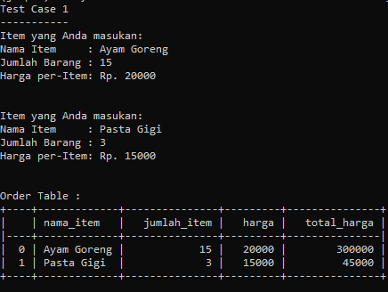
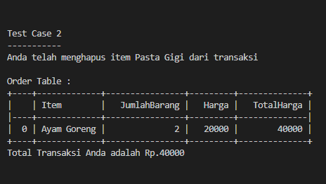
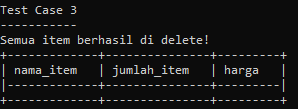
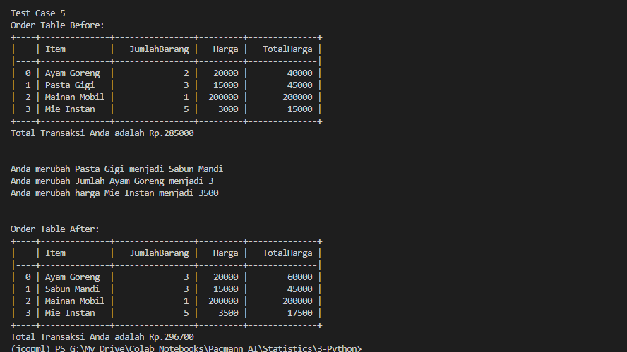

# *Python Project: Self-Service Cashier*

## Latar Belakang Problem

Andi adalah seorang pemilik supermarket besar di salah satu kota di Indonesia. Andi memiliki rencana untuk melakukan ekspansi bisnis, yaitu: Andi akan membuat sistem kasir yang self-service di supermarket miliknya. Sehingga customer bisa langsung memasukan item yang dibeli, jumlah yang dibeli dan fitur lain. Sehingga customer yang tidak berada di kota tersebut bisa membeli barang dari supermarket tersebut.

## *Tools*
### Bahasa Pemograman:
- Python

### *Libraries*:
- Pandas
- NumPy
- pytz
- datetime
- tabulate

## *Requirements / Objectives*
### Tujuan Pembelajaran:
- Membuat *Self-Service Cashier* menggunakan Python
- Menggunakan OOP dalam pembuatan program Python
- Mengaplikasikan *Data Structure, Branching, try, and error* pembuatan program Python
- Membuat dokumentasi *docstring* pembuatan program Python
- Mengaplikasikan PEP8 dalam penulisan *clean code* pada program Python

### Tujuan Program:
- Membuat objek dari `class Transaction()`
- Menambahkan *method* `add_item()` yang berisi parameter `nama_item`, `jumlah_item`, dan `harga_per_item` ke dalam *Self-Service Cashier*
- Menambahkan *method* `update_item_name()`, `update_item_qty()`, dan `update_item_price()`. Mengubah berdasarkan parameter `nama_item` untuk mengubah nilai tiap-tiap item, jumlah, dan harga ke dalam *Self-Service Cashier*. 
- Menambahkan *method* `delete_item()`ke dalam *Self-Service Cashier* untuk menghapus satu item berdasarkan parameter `nama_item`
- Menambahkan *method* `reset_transaction()` ke dalam *Self-Service Cashier* untuk menghapus semua transaksi
- Menambahkan *method* `check_order()` ke dalam *Self-Service Cashier* untuk melihat seluruh detail transaksi
- Menambahkan *method* `total_price()` ke dalam *Self-Service Cashier* untuk mengetahui total pembayaran, dengan beberapa ketentuan:
    - Jika total belanja di atas Rp.200.000 maka akan mendapatkan diskon 5%
    - Jika total belanja di atas Rp.300.000 maka akan mendapatkan diskon 8%
    - Jika total belanja di atas Rp.500.000 maka akan mendapatkan diskon 10%

## *Flowchart*

### Pseudocode
- *attribute class* berisi dataframe kosong

- *attribute* mengenai toko atau transaksi
    ```python
    def ___init___:
        nama toko
        alamat
        nomor telepon
        tanggal
        waktu
        timestamp
    ```

- add_item menambahkan item, jumlah dan harga ke dalam sesi transaksi
    ```python
    def add_item(nama_item, jumlah_item, harga_item):
        cek tipe data parameter
        masukan parameter ke dalam attribute class
    ```

- update_item_name merubah nama item jika terjadi kesalahan input
    ```python
    def update_item_name(nama_item, update_nama_item):
        cek tipe data parameter
        cek nama item dalam attribute class
        merubah nama item dalam attribute class
    ```

- update_item_qty merubah jumlah item berdasarkan nama item jika terjadi kesalahan input
    ```python
    def update_item_qty(nama_item, update_jumlah_item):
        cek tipe data parameter
        cek nama item di dalam attribute class
        merubah jumlah item berdasarkan nama item
    ```

- update_item_price merubah harga item berdasarkan nama item jika terjadi kesalahan input
    ```python
    def update_item_qty(nama_item, update_harga_item):
        cek tipe data parameter
        cek nama item di dalam attribute class
        merubah harga item berdasarkan nama item
    ```

- delete_item menghapus satu baris berdasarkan nama_item dalam transaksi 
    ```python
    def delete_item(nama_item):
        cek tipe data parameter
        cek nama item di dalam attribute class
        menghapus jumlah dan harga berdasarkan nama item
    ```

- reset_transaction menghapus semua sesi transaksi
    ```python
    def reset_transaction():
        menampilkan pesan item sudah di reset
        menampilakn tabel kosong
    ```

- check_order menampilkan semua detail transaksi dalam bentuk tabel
    ```python
    def check_order():
        membuat dataframe baru dengan cara copy attribute class
        manambahkan kolom total harga untuk tiap item
        membuat dan menampilkan tabel
    ```

- total_price menampilkan total belanja dari sesi transaksi dengan ketentuan diskon
    ```python
    def total_transaction():
        membuat dataframe baru dengan cara copy attribute class
        manambahkan kolom total harga untuk tiap item
        menjumlahkan kolom total harga
        if total belanja < 200000:
            harga normal
        if total belanja < 30000:
            diskon 5 persen
        if total belanja < 500000:
            diskon 8 persen
        if total belanja > 500000:
            diskon 10 persen
    ```

## *Function / Attribute*

### Class Atribute

```python
    empty_dict = {
        "Item": [], 
        "JumlahBarang": [], 
        "Harga": []}
    data = pd.DataFrame(empty_dict)
```
Pada *class attribute* berisikan dataframe kosong untuk menampung semua data transaksi

### Attribute

```python
def __init__(self):
        self.nama_toko = "Supermarket Andi"
        self.alamat = "Kota Besar"
        self.no_telepon = "08098888"

        now = datetime.datetime.now()

        self.date = (
            pytz.timezone("Asia/Jakarta").localize(now).strftime("%Y-%m-%d")
        )

        self.created_at = (
            pytz.timezone("Asia/Jakarta").localize(now).strftime("%H:%M:%S")
        )

        self.timestamp = now.timestamp()
```
Attribute ini berisi berbagai informasi toko dan transaksi, seperti: Nama Toko, Alamat, Nomor Telepon, Tanggal Transaksi, Waktu Transaksi, dan *Timestamp*.

### Method
- `add_item()`

    ```python
    def add_item(
        self, nama_item: str, jumlah_item: int, harga_item: float or int
    ):
        """Fungsi untuk menambahkan nama_item, jumlah_item, harga_item
            ke dalam attribute class data

        Args:
            nama_item (str): nama item
            jumlah_item (int): jumlah item
            harga_item (float or int): harga per item

        Raises:
            TypeError:
                Jika parameter nama_item bukan string
            TypeError:
                Jika parameter jumlah_item bukan integer
            TypeError:
                Jika parameter harga_item bukan float atau integer
        """

        self.nama_item = nama_item
        self.jumlah_item = jumlah_item
        self.harga_item = harga_item

        if type(nama_item) != str:
            raise TypeError(
                "Parameter 'nama_item' harus memiliki tipe data 'str'"
            )

        elif type(jumlah_item) != int:
            raise TypeError(
                "Parameter 'jumlah_item' harus memiliki tipe data 'int'"
            )

        elif type(harga_item) != float and type(harga_item) != int:
            raise TypeError(
                "Parameter 'harga_item' memiliki tipe data 'float' atau 'int'"
            )
        else:

            self.data.loc[len(self.data)] = [
                nama_item,
                jumlah_item,
                harga_item,
            ]
            print("Item yang Anda masukan:")
            print(f"Nama Item     : {nama_item}")
            print(f"Jumlah Barang : {jumlah_item}")
            print(f"Harga per-Item: Rp. {harga_item}")
    ```


## *Test Case*

1. Test Case 1 - Customer ingin menambahkan dua item menggunakan method `add_item()`. Item yang ditambahkan sebagai berikut:
    - Nama Item: Ayam Goreng, Qty: 2, Harga: 20.000
    - Nama Item: Pasta Gigi, Qty: 3, Harga: 15.000
<br/><br/>


    ```python
    user = Transaction()
    # Test Case 1
    # Add Item 1
    print("Test Case 1")
    print("-----------")
    user.add_item("Ayam Goreng", 2, 20_000)
    print("\n")
    # Add Item 2
    user.add_item("Pasta Gigi", 3, 15_000)
    print("\n")
    print("Order Table :")
    user.check_order()
    user.total_price()
    ```
    Output :
    <br/>

    

2. Test Case 2 - Ternyata Customer salah membeli salah satu item dari belnjaan yang sudah ditambahkan, maka Customer menggunakan method `delete_item()` untuk menghapus item. Item yang ingin dihapus adalah **Pasta Gigi**


    ```python
    # Test Case 2
    # Delete pasta gigi from order table
    print("\n")
    print("Test Case 2")
    print("-----------")
    user.delete_item("Pasta Gigi")
    print("Order Table :")
    user.check_order()
    user.total_price()
    ```

    Output :
    

3. Test Case 3 - Ternyata Customer salah memasukkan item yang ingin dibelanjakan! Daripada menghapus satu-satu, maka Customer cukup menggunakan method `reset_transaction()` untuk menghapus semua item yang sudah ditambahkan.
<br/>

    ```python
    # Test Case 3
    # Reset all transaction
    print("\n")
    print("Test Case 3")
    print("-----------")
    user.reset_transaction()
    ```

    Output :

    

4. Test Case 4 - Setelah Customer selesai berbelanja, akan menghitung total belanja yang harus dibayarkan menggunakan *method* `total_price()`. Sebelum mengeluarkan output total belanja akan menampilkan item-item yang dibeli.
<br/>

    ```python
    print("\n")
    print("Test Case 4")
    print("-----------")
    # Add Item 1
    user.add_item("Ayam Goreng", 2, 20_000)
    print("\n")
    # Add Item 2
    user.add_item("Pasta Gigi", 3, 15_000)
    print("\n")
    # Add Item 3
    user.add_item("Mainan Mobil", 1, 200_000)
    print("\n")
    # Add Item 4
    user.add_item("Mie Instan", 5, 3_000)
    print("\n")
    print("Order Table :")
    user.check_order()
    user.total_price()
    ```

    Output :
    

5. Test Case 5 - Ternyata Customer salah memasukan beberapa item, jumlah dan harga. Maka Custumer akan mengubahnya menggunakan *method* `update_item_name()`, `update_item_qty()`, dan `update_item_price()`
<br/>

    ```python
    # Test Case 5
    # Update Item, JumlahBarang, dan Harga
    print("\n")
    print("Test Case 5")
    print("-----------")
    print("Order Table Before:")
    user.check_order()
    user.total_price()
    print("\n")
    # Update Item pasta gigi
    user.update_item_name("Pasta Gigi", "Sabun Mandi")
    # Update JumlahBarang ayam goreng
    user.update_item_qty("Ayam Goreng", 3)
    # Update Harga mie instan
    user.update_item_price("Mie Instan", 3_500)
    print("\n")
    print("Order Table After:")
    user.check_order()
    user.total_price()
    ```

    Output :
    

## *Conclusion*


**Author** Copyright ⓒ 2022 Akhmad Taufik Ismail