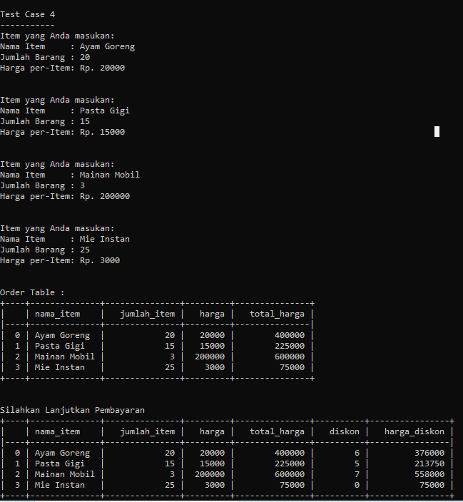
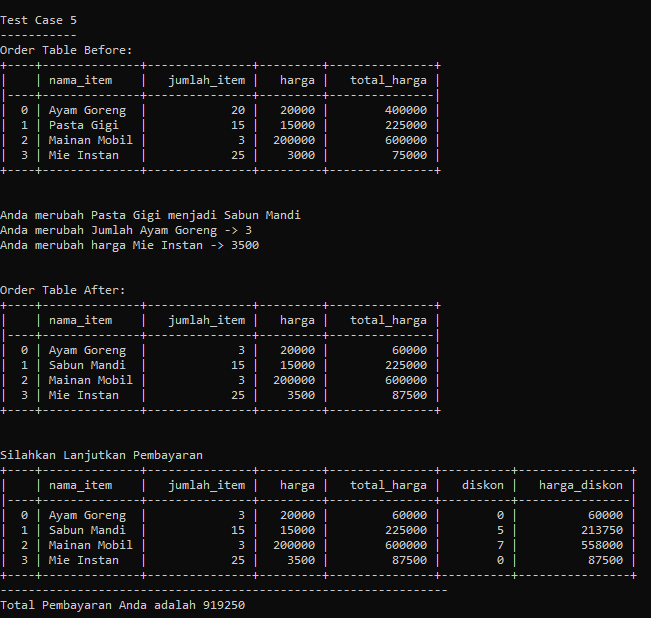

# _Python Project: Self-Service Cashier_

## Latar Belakang Problem

Andi adalah seorang pemilik supermarket besar di salah satu kota di Indonesia. Andi memiliki rencana untuk melakukan ekspansi bisnis, yaitu: Andi akan membuat sistem kasir yang self-service di supermarket miliknya. Sehingga customer bisa langsung memasukan item yang dibeli, jumlah yang dibeli dan fitur lain. Sehingga customer yang tidak berada di kota tersebut bisa membeli barang dari supermarket tersebut.

## _Objectives_

### Tujuan Pembelajaran:

- Membuat _Self-Service Cashier_ menggunakan Python
- Menggunakan OOP dalam pembuatan program Python
- Mengaplikasikan _Data Structure, Branching, try, and error_ pembuatan program Python
- Membuat dokumentasi _docstring_ pembuatan program Python
- Mengaplikasikan PEP8 dalam penulisan _clean code_ pada program Python

<br/>

### Tujuan Program:

- Membuat objek dari `class Transaction()`
- Menambahkan _method_ `add_item()` yang berisi parameter `nama_item`, `jumlah_item`, dan `harga_per_item` ke dalam _Self-Service Cashier_
- Menambahkan _method_ `update_item_name()`, `update_item_qty()`, dan `update_item_price()`. Mengubah berdasarkan parameter `nama_item` untuk mengubah nilai tiap-tiap item, jumlah, dan harga ke dalam _Self-Service Cashier_.
- Menambahkan _method_ `delete_item()`ke dalam _Self-Service Cashier_ untuk menghapus satu item berdasarkan parameter `nama_item`
- Menambahkan _method_ `reset_transaction()` ke dalam _Self-Service Cashier_ untuk menghapus semua transaksi
- Menambahkan _method_ `check_order()` ke dalam _Self-Service Cashier_ untuk melihat seluruh detail transaksi
- Menambahkan _method_ `check_out()` ke dalam _Self-Service Cashier_ untuk mengetahui total belanja, dengan beberapa ketentuan:
  - Jika total harga per item di atas Rp.200.000 maka akan mendapatkan diskon 5%
  - Jika total harga per item di atas Rp.300.000 maka akan mendapatkan diskon 6%
  - Jika total harga per item di atas Rp.500.000 maka akan mendapatkan diskon 7%
  - Setiap kali _method_ `check_out()` dijalankan, data transaksi akan dimasukkan ke dalam sqlite database.

<br/>

## _Requirements_

Program ini membutuhkan beberapa _library_ dan modul tambahan yang harus diinstal sebelum menjalankan program:

1. `pandas`: _library_ untuk memanipulasi dan menganalisis data dalam bentuk DataFrame.
2. `pytz`: _library_ untuk bekerja dengan zona waktu dan penanganan waktu.
3. `tabulate`: _library_ untuk membuat tabel dari data dalam berbagai format.
4. `database`: Modul yang menyediakan fungsi untuk mengelola database terkait operasi transaksi.

Untuk menggunakan modul database dengan sukses, Anda perlu memenuhi persyaratan berikut:

1. `Python`: Pastikan Anda telah menginstal Python di sistem Anda.
2. `SQLAlchemy`: _library_ `sqlalchemy` harus diinstal. Anda dapat menginstalnya menggunakan perintah `pip install sqlalchemy`.

<br/>

## _Flowchart_

### Module `database`

Modul `database` menangani pembuatan database SQLite dan sebuah tabel bernama 'transactions' untuk menyimpan data transaksi. _Flowchart_ untuk kode tersebut adalah sebagai berikut:

1. Mengimpor library yang diperlukan: Modul ini mengimpor kelas dan fungsi yang diperlukan dari `sqlalchemy` untuk berinteraksi dengan database SQLite.

2. Mendefinisikan struktur tabel: Modul ini mendefinisikan struktur tabel 'transactions', menentukan tipe data dari setiap kolom, primary key, dan nilai default menggunakan kelas 'Column'.

3. Membuat database dan tabel: Fungsi `create_db()` bertanggung jawab untuk membuat database SQLite dan tabel 'transactions'. Fungsi ini membuat koneksi ke database menggunakan _engine_ yang telah ditentukan, mengeksekusi kueri SQL untuk membuat tabel jika tidak ada.

4. Menyisipkan data ke dalam tabel: Fungsi `insert_to_table(data_list)` bertanggung jawab untuk memasukkan data ke dalam tabel 'transactions'. Fungsi ini melakukan tugas-tugas berikut:

   - Memanggil `Base.metadata.create_all(engine)`.
   - Membuat sesi menggunakan _class_ `sessionmaker` untuk mengelola interaksi database.
   - Melakukan perulangan melalui setiap entri dalam `data_list` dan membuat objek `Transaksi` dengan data entri tersebut.
   - Menambahkan setiap objek `Transaksi` ke sesi untuk dimasukkan ke dalam database.
   - Melakukan perubahan ke database.

### Module `cashier`


Fig. 1 Merupakan flowchart atau alur program _self-service cashier_.

<br/>

Flowchart di atas menggambarkan langkah-langkah dan aliran logika dari kelas `Transaction`. Berikut adalah penjelasan alur code dalam program:

1. Inisialisasi:

   - Program dimulai dengan menginisialisasi data atribut dalam kelas `Transaction`, seperti `data`, `nama_toko`, `alamat`, `no_telepon`, `date`, `created_at`, dan `timestamp`.

   - Library dan modul yang diperlukan juga diimpor, seperti Pandas, pytz, dan tabulate.

2. Menambah Item (`add_item`):

   - Fungsi ini digunakan untuk menambahkan item baru ke dalam data atribut `data` pada kelas `Transaction`.
   - Fungsi ini menerima tiga parameter, yaitu `nama_item` (str), `jumlah_item` (int), dan `harga` (float atau int).
   - Sebelum menambahkan item, fungsi akan melakukan beberapa validasi untuk memastikan data yang dimasukkan benar, seperti memastikan `nama_item` adalah string, `jumlah_item` adalah integer positif, dan `harga` adalah float atau integer positif.

3. Mengupdate Nama Item (`update_item_name`):

   - Fungsi ini digunakan untuk mengupdate nama item yang ada dalam data atribut `data`.
   - Fungsi ini menerima dua parameter, yaitu `nama_item` (str) dan `update_nama_item` (str).
   - Sebelum mengupdate nama item, fungsi akan memastikan `nama_item` yang ada dalam data dan melakukan validasi untuk memastikan parameter yang dimasukkan adalah string.

4. Mengupdate Jumlah Item (`update_item_qty`):

   - Fungsi ini digunakan untuk mengupdate jumlah item dari item yang ada dalam data atribut `data`.
   - Fungsi ini menerima dua parameter, yaitu `nama_item` (str) dan `update_jml_item` (int).
   - Sebelum mengupdate jumlah item, fungsi akan memastikan `nama_item` yang ada dalam data, memastikan `nama_item` adalah string, dan `update_jml_item` adalah integer positif.

5. Mengupdate Harga Item (`update_item_price`):

   - Fungsi ini digunakan untuk mengupdate harga dari item yang ada dalam data atribut `data`.
   - Fungsi ini menerima dua parameter, yaitu `nama_item` (str) dan `update_harga` (float atau int).
   - Sebelum mengupdate harga item, fungsi akan memastikan `nama_item` yang ada dalam data, memastikan `nama_item` adalah string, dan `update_harga` adalah float atau integer positif.

6. Menghapus Item (`delete_item`):

   - Fungsi ini digunakan untuk menghapus item yang ada dalam data atribut `data`.
   - Fungsi ini menerima satu parameter, yaitu `nama_item` (str).
   - Sebelum menghapus item, fungsi akan memastikan `nama_item` yang ada dalam data dan memastikan parameter yang dimasukkan adalah string.

7. Melihat Pesanan (`check_order`):

   - Fungsi ini digunakan untuk menghitung dan menampilkan total harga untuk tiap item yang ada dalam data atribut `data`.
   - Fungsi ini tidak menerima parameter.
   - Fungsi ini akan membuat tabel dari data dengan menambahkan kolom "total_harga" yang merupakan hasil dari perhitungan jumlah_item \* harga untuk setiap item.

8. Melakukan Check Out (`check_out`):

   - Fungsi ini digunakan untuk menghitung total harga dan diskon untuk tiap item dalam data atribut data.
   - Fungsi ini tidak menerima parameter.
   - Fungsi ini akan menghitung diskon berdasarkan total harga setiap item dan menambahkan kolom "diskon" dan "harga_diskon" ke data atribut `data`.

9. Reset Transaksi (`reset_transaction`):
   - Fungsi ini digunakan untuk menghapus semua item dalam data atribut `data`.
   - Fungsi ini tidak menerima parameter.
   - Fungsi ini akan menghapus semua data dalam `data` dan menampilkan tabel kosong sebagai hasilnya.

<br/>

## _Function_ dan _Attribute_

### _Module_ `database`

Modul database berisi fungsi berikut:

1. **Fungsi `create_db`**

   - Tujuan: Fungsi ini membuat database SQLite dan tabel bernama 'transactions' jika belum ada. Fungsi ini melakukan tugas-tugas berikut:
     - Membuat mesin database untuk database SQLite dengan nama 'andi-supermarket.db'.
     - Mendefinisikan kueri SQL untuk membuat tabel 'transactions' dengan kolom-kolom untuk detail transaksi seperti nama item, jumlah, harga, harga total, diskon, harga akhir, dan timestamp.
     - Menghubungkan ke database dan mengeksekusi kueri SQL untuk membuat tabel.
   - Parameter: `None`
   - Raises:
     - `SQLAlchemyError`: Jika terjadi kesalahan saat membuat tabel.
   - Contoh:
     ```python
     create_db()
     ```

   > Catatan:
   >
   > - Sebelum memanggil fungsi ini, mesin database harus dikonfigurasi dengan dependensi yang diperlukan.
   > - Jika tabel 'transactions' sudah ada, fungsi ini tidak akan membuat tabel baru.

2. **Fungsi `insert_to_table(data_list)`**

   - Fungsi ini menyisipkan data ke dalam tabel 'orders' menggunakan SQLAlchemy. Fungsi ini menerima sebuah list kamus, di mana setiap kamus berisi data untuk satu entri dalam tabel. Fungsi ini melakukan tugas-tugas berikut:
     - Membuat _engine_ database untuk database SQLite dengan nama 'andi-supermarket.db'.
     - Membuat tabel 'transactions' jika belum ada menggunakan metode `Base.metadata.create_all(engine)`.
     - Membuat sesi menggunakan _class_ `sessionmaker` untuk mengelola interaksi database.
     - Melakukan perulangan melalui setiap entri dalam `data_list` dan membuat objek `Transaction` dengan data entri tersebut.
     - Menambahkan setiap objek `Transaction` ke sesi untuk dimasukkan ke dalam database.
     - Melakukan perubahan ke database.
   - Parameter:
     - `data_list` (_list of dict_): Sebuah _list of dict_ di mana setiap _`dict`_ berisi data untuk satu entri dalam tabel 'transactions'.
   - Contoh:

     ```python
     data_list = [
         {
             'nama_item': 'Item A',
             'jumlah_item': 5,
             'harga': 10000,
             'total_harga': 50000,
             'diskon': 10,
             'harga_diskon': 45000
         },
     ]

     insert_to_table(data_list)

     ```

Modul database bertanggung jawab untuk menciptakan dan menyimpan data transaksi aplikasi Supermarket Andi melalui database dan tabel yang dibuat. Dengan demikian, data transaksi tetap tersimpan secara persisten, dan akses ke transaksi sebelumnya menjadi lebih mudah. Fungsi insert_to_table(data_list) pada modul ini juga berperan dalam menyisipkan data ke dalam tabel 'transactions' pada database SQLite, yang secara konsisten memastikan penyimpanan data transaksi untuk aplikasi Supermarket Andi.

### _Module_ `cashier`

1. **Attribute `data`**:

   - Merupakan DataFrame dari Pandas yang digunakan untuk menyimpan data sementara sebuah transaksi, seperti nama_item, jumlah_item, dan harga.

2. **Fungsi `add_item`**:

   - Tujuan: Fungsi ini digunakan untuk menambahkan item baru ke dalam data transaksi.
   - Parameter:
     - `nama_item` (str): Nama item yang akan ditambahkan.
     - `jumlah_item` (int): Jumlah item yang akan ditambahkan.
     - `harga` (float atau int): Harga per item.
   - Fungsionalitas: Fungsi ini pertama-tama memvalidasi parameter masukan untuk memastikan tipe data yang benar (string untuk `nama_item`, bilangan bulat positif untuk `jumlah_item`, dan bilangan pecahan positif atau bilangan bulat untuk `harga`). Kemudian, fungsi ini menambahkan detail item ke DataFrame `data`, dan mencetak detail item sebagai konfirmasi.

3. **Fungsi `update_item_name`**:

   - Tujuan: Fungsi ini digunakan untuk memperbarui nama dari item yang sudah ada dalam data transaksi.
   - Parameter:
     - `nama_item` (str): Nama saat ini dari item yang akan diperbarui.
     - `update_nama_item` (str): Nama baru untuk diperbarui pada item.
   - Fungsionalitas: Fungsi ini pertama-tama memeriksa apakah `nama_item` ada dalam DataFrame `data`. Jika ditemukan, fungsi ini memvalidasi parameter masukan untuk memastikan tipe data berupa string. Kemudian, fungsi ini memperbarui `nama_item` pada baris yang sesuai dalam DataFrame, dan mencetak pesan konfirmasi.

4. **Fungsi `update_item_qty`**:

   - Tujuan: Fungsi ini digunakan untuk memperbarui jumlah dari item yang sudah ada dalam data transaksi.
   - Parameter: - `nama_item` (str): Nama item yang akan diperbarui jumlahnya. - `update_jml_item` (int): Jumlah baru untuk diperbarui pada item.
     Fungsionalitas: Fungsi ini pertama-tama memeriksa apakah `nama_item` ada dalam DataFrame `data`. Jika ditemukan, fungsi ini memvalidasi parameter masukan untuk memastikan `nama_item` berupa string dan `update_jml_item` berupa bilangan bulat positif. Kemudian, fungsi ini memperbarui jumlah (`jumlah_item`) untuk item yang sesuai dalam DataFrame, dan mencetak pesan konfirmasi.

5. **Fungsi `update_item_price`**:

   - Tujuan: Fungsi ini digunakan untuk memperbarui harga dari item yang sudah ada dalam data transaksi.
   - Parameter:
     - `nama_item` (str): Nama item yang akan diperbarui harganya.
     - `update_harga` (float atau int): Harga baru untuk diperbarui pada item.
   - Fungsionalitas: Fungsi ini pertama-tama memeriksa apakah `nama_item` ada dalam DataFrame `data`. Jika ditemukan, fungsi ini memvalidasi parameter masukan untuk memastikan `nama_item` berupa string dan `update_harga` berupa bilangan pecahan positif atau bilangan bulat. Kemudian, fungsi ini memperbarui harga (`harga`) untuk item yang sesuai dalam DataFrame, dan mencetak pesan konfirmasi.

6. **Fungsi `delete_item`**:

   - Tujuan: Fungsi ini digunakan untuk menghapus item dari data transaksi.
   - Parameter:
     - `nama_item` (str): Nama item yang akan dihapus.
   - Fungsionalitas: Fungsi ini memeriksa apakah `nama_item` ada dalam DataFrame `data`. Jika ditemukan, fungsi ini menghapus baris yang sesuai dari DataFrame, dan mencetak pesan konfirmasi. Jika tidak ditemukan, fungsi ini mencetak pesan bahwa item tidak ditemukan dalam sesi transaksi.

7. **Fungsi `reset_transaction`**:

   - Tujuan: Fungsi ini digunakan untuk menghapus semua item dari data transaksi, efektifnya mereset transaksi.
   - Parameter: `None`
   - Fungsionalitas: Fungsi ini menghapus semua `data` dari DataFrame data, sehingga mengosongkannya menjadi DataFrame kosong. Fungsi ini mencetak pesan yang mengkonfirmasi bahwa semua item telah dihapus.

8. **Fungsi `check_order`**:

   - Tujuan: Fungsi ini digunakan untuk menghitung dan menampilkan total harga untuk setiap item dalam data transaksi.
   - Parameter: `None`
   - Fungsionalitas: Fungsi ini membuat DataFrame baru (`output_data`) dengan menyalin DataFrame data. Kemudian, menghitung total harga (`total_harga`) untuk setiap item dan menambahkan kolom baru ke DataFrame `output_data`. Fungsi ini kemudian menampilkan tabel menggunakan library `tabulate`.

9. **Fungsi `check_out`**:
   - Tujuan: Fungsi ini digunakan untuk menghitung total harga dan diskon untuk setiap item dan memberikan jumlah pembayaran akhir untuk seluruh transaksi.
   - Parameter: `None`
   - Fungsionalitas: Fungsi ini membuat database (jika belum ada) menggunakan fungsi `create_db()`. Kemudian, membuat DataFrame baru (`output_data`) dengan menyalin DataFrame `data` dan menghitung total harga (`total_harga`) untuk setiap item. Juga menambahkan kolom baru untuk diskon (`diskon`) dan harga diskon (`harga_diskon`). Fungsi ini kemudian menghitung diskon yang sesuai berdasarkan total harga dan mengaplikasikannya ke setiap item. Terakhir, fungsi ini menampilkan tabel dengan semua detail dan jumlah pembayaran total. Fungsi ini juga mengonversi DataFrame `output_data` menjadi _list of dictionary_ dan menyisipkannya ke dalam database menggunakan fungsi `insert_to_table()`.

<br/>

## _Test Case_

1.  Test Case 1 - Customer ingin menambahkan dua item menggunakan method `add_item()`. Item yang ditambahkan sebagai berikut: - Nama Item: Ayam Goreng, Qty: 2, Harga: 20.000 - Nama Item: Pasta Gigi, Qty: 3, Harga: 15.000

        ```python
        user = Transaction()
        # Test Case 1
        # Add Item 1
        print("Test Case 1")
        print("-----------")
        user.add_item("Ayam Goreng", 15, 20_000)
        print("\n")
        # Add Item 2
        user.add_item("Pasta Gigi", 3, 15_000)
        print("\n")
        print("Order Table :")
        user.check_order()
        ```
    
       Output :

       

3.  Test Case 2 - Ternyata Customer salah membeli salah satu item dari belnjaan yang sudah ditambahkan, maka Customer menggunakan method `delete_item()` untuk menghapus item. Item yang ingin dihapus adalah **Pasta Gigi**

    ```python
    # Test Case 2
    # Delete pasta gigi from order table
    print("\n")
    print("Test Case 2")
    print("-----------")
    user.delete_item("Pasta Gigi")
    print("Order Table :")
    user.check_order()
    user.check_out()
    ```

       Output :

       

4.  Test Case 3 - Ternyata Customer salah memasukkan item yang ingin dibelanjakan! Daripada menghapus satu-satu, maka Customer cukup menggunakan method `reset_transaction()` untuk menghapus semua item yang sudah ditambahkan.

    ```python
    # Test Case 3
    # Reset all transaction
    print("\n")
    print("Test Case 3")
    print("-----------")
    user.reset_transaction()
    ```

    Output :

    

5.  Test Case 4 - Setelah Customer selesai berbelanja, akan menghitung total belanja yang harus dibayarkan menggunakan _method_ `total_price()`. Sebelum mengeluarkan output total belanja akan menampilkan item-item yang dibeli.

    ```python
      print("\n")
      print("Test Case 4")
      print("-----------")
      # Add Item 1
      user.add_item("Ayam Goreng", 20, 20_000)
      print("\n")
      # Add Item 2
      user.add_item("Pasta Gigi", 15, 15_000)
      print("\n")
      # Add Item 3
      user.add_item("Mainan Mobil", 3, 200_000)
      print("\n")
      # Add Item 4
      user.add_item("Mie Instan", 25, 3_000)
      print("\n")
      print("Order Table :")
      user.check_order()
      user.check_out()
    ```

    Output :

    

6.  Test Case 5 - Ternyata Customer salah memasukan beberapa item, jumlah dan harga. Maka Custumer akan mengubahnya menggunakan _method_ `update_item_name()`, `update_item_qty()`, dan `update_item_price()`

    ```python
    # Test Case 5
      # Update Item, JumlahBarang, dan Harga
      print("\n")
      print("Test Case 5")
      print("-----------")
      print("Order Table Before:")
      user.check_order()
      print("\n")
      # Update Item pasta gigi
      user.update_item_name("Pasta Gigi", "Sabun Mandi")
      # Update JumlahBarang ayam goreng
      user.update_item_qty("Ayam Goreng", 3)
      # Update Harga mie instan
      user.update_item_price("Mie Instan", 3_500)
      print("\n")
      print("Order Table After:")
      user.check_order()

      user.check_out()
    ```

    Output :

    

<br/>

## _Conclusion_

Program cashier Supermarket Andi merupakan aplikasi kasir sederhana yang memungkinkan pengguna untuk melakukan transaksi pembelian barang di supermarket. Program ini dibuat menggunakan bahasa Python dan menggunakan beberapa library seperti pandas, pytz, tabulate, dan SQLAlchemy.

Dalam program ini, terdapat kelas `Transaction` yang merepresentasikan transaksi kasir dengan berbagai fungsi dasar seperti menambah, mengupdate, dan menghapus item transaksi. Selain itu, program ini juga menghitung total harga untuk tiap item dan menerapkan diskon berdasarkan total harga.

Beberapa fitur utama dari program ini meliputi:

1. Menambahkan item ke dalam transaksi dengan fungsi add_item.
2. Mengupdate nama item, jumlah item, atau harga item dengan fungsi update_item_name, update_item_qty, dan update_item_price.
3. Menghapus item dari transaksi dengan fungsi delete_item.
4. Melakukan check-out dan menghitung total harga serta diskon untuk tiap item dengan fungsi check_out.

Program ini juga memiliki fitur untuk menyimpan data transaksi ke dalam database SQLite dengan bantuan modul `database` yang memanfaatkan SQLAlchemy.

Potensi untuk perbaikan (_improvement_):

- Error Handling: Saat ini, program hanya mencetak pesan kesalahan jika terjadi kesalahan dalam mengakses database. Perlu diperbaiki dengan penanganan kesalahan yang lebih baik, termasuk memberikan pesan kesalahan yang lebih informatif untuk membantu pemecahan masalah.

- User Interface: Program saat ini hanya berjalan di terminal dan tidak memiliki antarmuka grafis. Pengembangan lebih lanjut bisa dilakukan untuk menciptakan antarmuka pengguna yang lebih interaktif dan intuitif.

- Data Persistance: Selain menyimpan data transaksi ke dalam database SQLite, program dapat diperluas untuk mendukung sistem manajemen basis data yang lebih robust seperti MySQL, PostgreSQL, atau MongoDB.

- Handling Data Duplikat: Saat ini, program tidak mengatasi kasus duplikasi item dalam transaksi. Dapat ditambahkan fitur untuk menangani kasus duplikasi dan menggabungkan jumlah item yang sama.

- Validasi Input: Dalam beberapa fungsi, perlu dilakukan validasi input lebih ketat untuk menghindari masalah data yang tidak valid.

- Optimisasi Performa: Program dapat diperbaiki secara keseluruhan untuk meningkatkan performa dan efisiensi, terutama dalam operasi database dan perhitungan diskon.

Dalam pengembangan lebih lanjut, hal-hal di atas dapat dipertimbangkan untuk membuat program cashier Supermarket Andi menjadi lebih kuat, lebih aman, dan lebih mudah digunakan oleh pengguna.

<br/>

**Author** Copyright ⓒ 2023 Akhmad Taufik Ismail
